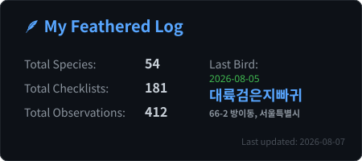
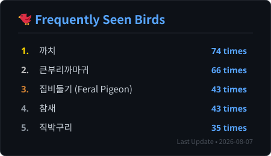
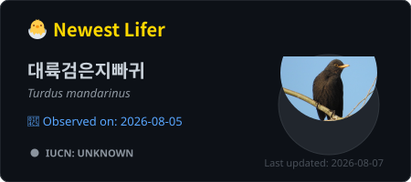
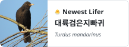

# 🐦 eBird-Card

> Turn your birding activity into a beautiful GitHub profile card.

Generate a clean and stylish SVG stats card from your eBird data, built specifically for GitHub Profile READMEs.

---

## 🚀 Demo & Preview

<p align="center">
  <br><br>
  <br><br>
  <br><br>
  
</p>

<p align="center">
  <em>A simple way to showcase your recent eBird activity, total species, and latest sighting directly on your GitHub profile.</em>
</p>

---

## ✨ Features

- **Key Statistics**: Display your total species, checklists, and observations at a glance.
- **Latest Birding Session**: Automatically tracks your last birding date, location, and the last bird you sighted.
- **Custom Location Formats**: Choose how your location is displayed (`location`, `state`, `country`, or hidden with `none`).
- **Custom Card Titles**: Personalize your card title (defaults to `🪶 My Feathered Log`).
- **Automated Workflow**: Powered by GitHub Actions for easy manual generation using your eBird export data.

---

## 📥 How to Download Your eBird Data

1. **Visit eBird Data Download**: Go to [eBird Data Download ↗](https://ebird.org/downloadMyData) and log in to your account.
2. **Request Observations**: 
   - Check that your email address is correct (e.g., `your-email@example.com`).
   - Click the **"Request My Observations"** button under *My eBird Observations* to request your entire observation history and checklist metadata.
3. **Wait for the Email**:
   - After requesting, eBird will process your data. Once it's ready, you will receive an official email from `do-not-reply@ebird.org` with the subject **"Your eBird data are now available for download"**.
   - *(Note: If you do not receive an email within 24 hours, check your spam folder, verify your email address, and ensure `do-not-reply@ebird.org` is added to your allowed contacts list before trying again).*
4. **Get the Download Link**: Open the email when it arrives, copy the long S3 download link (`https://...`), and paste it into your GitHub Actions workflow when generating your stats card!

---

## 🛠️ How to Use

1. **Fork this repository** to your GitHub account.
2. **Request your eBird data** from the eBird website and get your download ZIP link.
3. **Run the GitHub Action**:
   - Go to your repository's **Actions** tab.
   - Select **Update eBird Card** from the left sidebar.
   - Click **Run workflow**, paste your eBird ZIP download URL, select your location display mode, and click **Run workflow**.
4. **Copy & Paste your Card**:
   - Once the action completes, click on the workflow run and check the **Summary** page.
   - You will find the complete markdown code ready with a copy button, automatically tailored with your username!
   - Click the copy button and paste it into your profile `README.md` or Notion.

---

### 🚀 Quick Action Badge (Optional)

If you want to add a workflow shortcut badge to the top of your repository, use the code below:  
*(Make sure to replace `<your-github-username>` with your actual GitHub username if you forked it!)*

[](https://github.com/oseconds/eBird-card/actions/workflows/generate-eBird-card.yml)

```markdown
[](https://github.com/<your-github-username>/eBird-card/actions/workflows/generate-eBird-card.yml)

```

---

## ⚙️ Workflow Inputs (`workflow_dispatch`)

When running the workflow manually, you can configure:

* **`zip_url`**: The direct download link to your eBird data ZIP file (Required).
* **`location_mode`**: Choose how location is displayed (`location`, `state`, `country`, or `none`).
* **`card_title`**: Custom title for your card (Leave blank for the default `🪶 My Feathered Log`).

---

## 📝 Acknowledgments & Licenses

This project utilizes the following open-source assets:

* **Emojis**: [Twemoji](https://github.com/jdecked/twemoji)
* **License**: [CC-BY 4.0](https://creativecommons.org/licenses/by/4.0/) (Copyright Twitter, Inc. and other contributors)


* **Fonts**: [Noto Sans CJK](https://github.com/googlefonts/noto-cjk)
* **License**: [SIL Open Font License, Version 1.1](https://scripts.sil.org/OFL) (Copyright © Google Inc. and Adobe Systems Incorporated)


