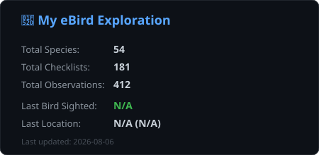

# eBird-readme-card

> Turn your birding activity into a beautiful GitHub profile card.

Generate a clean and stylish SVG stats card from your eBird data, built specifically for GitHub Profile READMEs.

---

## 🚀 Demo & Preview

  

A simple way to showcase your recent eBird activity, total species, and latest sighting directly on your GitHub profile.

---

## ✨ Features

- **Key Statistics**: Display your total species, checklists, and observations at a glance.
- **Latest Birding Session**: Automatically tracks your last birding date, location, and the last bird you sighted.
- **Custom Location Formats**: Choose how your location is displayed (`location`, `state`, `country`, or hidden with `none`).
- **Custom Card Titles**: Personalize your card title (defaults to `🪶 My Feathered Log`).
- **Automated Workflow**: Powered by GitHub Actions for easy manual generation using your eBird export data.

---

## 📥 How to Download Your eBird Data

1. **Visit eBird Data Download**: Go to <a href="https://ebird.org/downloadMyData" target="_blank" rel="noopener noreferrer">[eBird Data Download ↗]</a> and log in to your account.
2. **Request Observations**: 
   - Check that your email address is correct (e.g., `your-email@example.com`).
   - Click the **"Request My Observations"** button under *My eBird Observations* to request your entire observation history and checklist metadata.
3. **Wait for the Email**:
   - After requesting, eBird will process your data. Once it's ready, you will receive an official email from `do-not-reply@ebird.org` with the subject **"Your eBird data are now available for download"**.
   - *(Note: If you do not receive an email within 24 hours, check your spam folder, verify your email address, and ensure `do-not-reply@ebird.org` is added to your allowed contacts list before trying again).*
4. **Get the Download Link**: Open the email when it arrives, copy the long S3 download link (`https://...`), and paste it into your GitHub Actions workflow when generating your stats card!

---

## 🛠️ How to Use

1. **Fork this repository** to your GitHub account.
2. **Request your eBird data** and get the download ZIP link (as shown above).
3. **Run the GitHub Action**:

   
   - Go to your repository's **Actions** tab.
   - Select **Update README cards**.
   - Click **Run workflow**.
   - Paste your eBird ZIP download URL, select your preferred **Location Display Mode**, and optionally enter a **Custom Title**.
4. **Add to your GitHub Profile README**:
   
   ``
   
   *(Make sure to replace `<your-github-username>` with your actual GitHub username!)*

---

## ⚙️ Workflow Inputs (`workflow_dispatch`)

When running the workflow manually, you can configure:
- **`zip_url`**: The direct download link to your eBird data ZIP file (Required).
- **`location_mode`**: Choose how location is displayed (`location`, `state`, `country`, or `none`).
- **`card_title`**: Custom title for your card (Leave blank for the default `🪶 My Feathered Log`).

---

## 📄 License

MIT License
